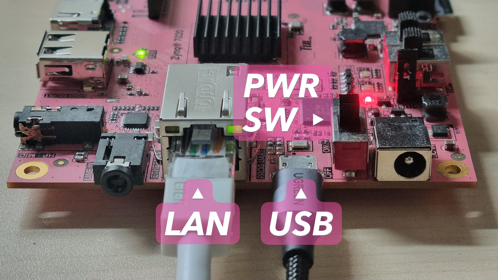
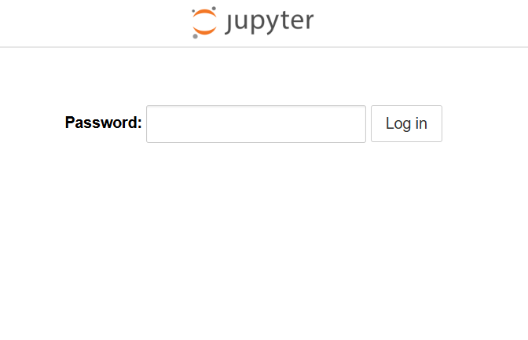
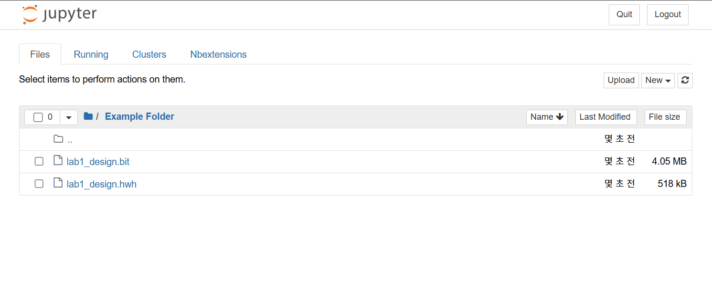
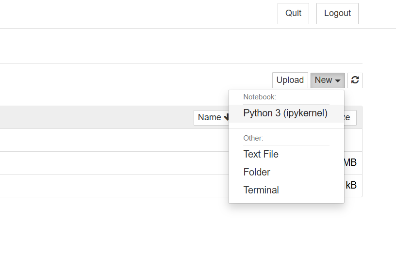

## LAB 1: Pynq-Z2 board w. FFT example

### Environmental Setup

#### PORTS

&emsp;Below is an overview of the interfaces frequently used in this course.

| Port | Description |  
| :-- | :-- |  
| `LAN` | Ethernet port used by Pynq to host the Jupyter Notebook server |
| `USB` | Serial port for communication between Pynq and the host device *(Type-B Micro)* |
| `PWR SW` | Physical power switch for the Pynq board |



---

#### Connections

&emsp;Before accessing the Pynq board, establish the following network environment:

```
# connection diagram

┌─────────┐    wired or    ┌──────┐   # HOST can by any device capable of 
│         ├─ wireless LAN ─┤ HOST │   # accessing the local network provided
│ Network │                └───┬──┘   # by the Network Router.
│         │                   USB
│ Router  │               ┌────┴────┐
│         ├── wired LAN ──┤ Pynq-Z2 │
└─────────┘               └─────────┘
```

&emsp;Once the environment is set up, power on both `HOST` and `Pynq-Z2`. Then, run the following command in the `HOST`'s terminal (e.g., `PowerShell` on Windows or `Terminal` in Linux):

```Bash
ping pynq
```

&emsp;Expected output:

```Bash
# Windows
Pinging pynq [X.X.X.X] with 32 bytes of data:
...

# Linux
PING pynq (X.X.X.X) 56(84) bytes of data.
...
```

&emsp;Once a response is received, the Pynq board's **ip address** (X.X.X.X) is confirmed. The ip address may change every time the Pynq board is rebooted, so always run `ping` before using the board.

&emsp;Open a web browser and navigate to the **ip address** &mdash; you will be redirected to the Jupyter Notebook login screen.



&emsp;Enter `xilinx` as the password and click ***Log in***. You may remove any of the default folders and files if desired.

</br>

---

### Jupyter Notebook Tutorial

1. Upload the `.bit` and `.hwh` files to the Jupyter Notebook.  
   > **NOTE**   
   > Both files must share the same filename, differing only in their extensions.

    

    ---

1. Press ***New*** → ***Python 3 (ipykernel)*** to make new Notebook file.

    

    ---

1. Enter the following script in the notebook and execute it:  

    ***`In [1]:`***  
    ```python
    from pynq import Overlay, allocate

    overlay = Overlay( "<YOUR_BITSTREAM_FILENAME_IN_STR>" )
                        # e.g., "lab1_design.bit"
    ```

    ***`In [2]:`***  
    ```python
    [attr for attr in dir(overlay) if not attr.startswith('_')]
    ```

    Expected output:

    ***`Out [2]:`***  
    ```python
    [...,
     'axi_dma_0',
     'axi_dma_1',
     'axi_dma_2',
     ...,
     'processing_system7_0',
     ...]
    ```

    As shown, you can access each DMA object through its name.

    ---

1. Bundle the DMAs into a single `DMA` class:

    ***`In [4]:`***  
    ```python
    class DMA:
        IN  = overlay.axi_dma_0
        CFG = overlay.axi_dma_1
        OUT = overlay.axi_dma_2
    ```

    We also need a buffer-like object to store data in a DMA-transferable format.

    ***`In [5]:`***
    ```python
    class Buffer:
        def __init__(self, logN):
            self.logN = logN
            self.N = 2 ** logN
        
            self.IN  = allocate(shape=(self.N,), dtype='uint32')
            self.CFG = allocate(shape=(1,), dtype='uint32')
            self.OUT = allocate(shape=(self.N,), dtype='uint32')
    ```

1. Write the following script for the main kernel:

    ***`In [6]:`***
    ```python
    import math
    import numpy as np

    def run_hw_fft(data: np.ndarray):
        # gatekeeper handling unexpected length of data
        logN = math.ceil(math.log2(len(data)))
        assert logN <= 16, \
        "current overlay cannot handle the large size of FFT kernel exceeds 65536"
    
        # create buffer object and zero-padding to data
        BUFFER = Buffer(logN)
        data = np.append(data, np.zeros(BUFFER.N-len(data), dtype=data.dtype))
    
        # transfer FFT configuration
        BUFFER.CFG[0] = BUFFER.logN
        DMA.CFG.sendchannel.transfer(BUFFER.CFG)
        DMA.CFG.sendchannel.wait()
    
        # transfer FFT data
        np.copyto(BUFFER.IN, data)
        DMA.IN.sendchannel.transfer(BUFFER.IN)
        DMA.OUT.recvchannel.transfer(BUFFER.OUT)
    
        # wait DMA transfer to be done
        DMA.IN.sendchannel.wait()
        DMA.OUT.recvchannel.wait()
    
        return BUFFER.OUT
    ```

    ***`In [7]:`***
    ```python
    sample = np.random.randint(20, size=(1000,), dtype='uint32')
    run_hw_fft(sample)
    ```

    Example output:

    ***`Out [7]:`***  
    ```python
    PynqBuffer([      9591,        149,    8716312, ..., 4294639587,
                   3145666, 4289986332], dtype=uint32)
    ```

    ---

1. Based on this tutorial, write your own driver code for the questions requested in the report.