## LAB 2: Vitis HLS - Scalar Add

### Vivado Tutorial

1. Open Vivado and create a project as done in [LAB 1](../LAB1/LAB1_VIVADO.md). Press ***Settings*** on the toolbar.

    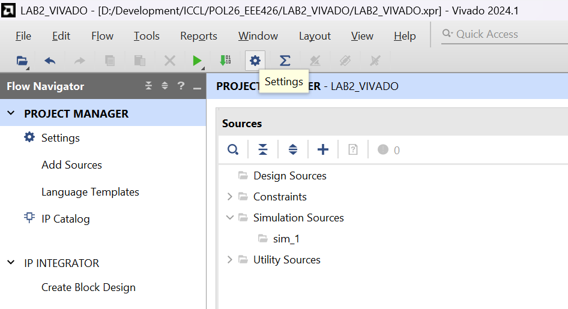

    ---

1. Go to **IP** &ndash; **Repository**, press the '**+**' button to add new path as an IP repository.

    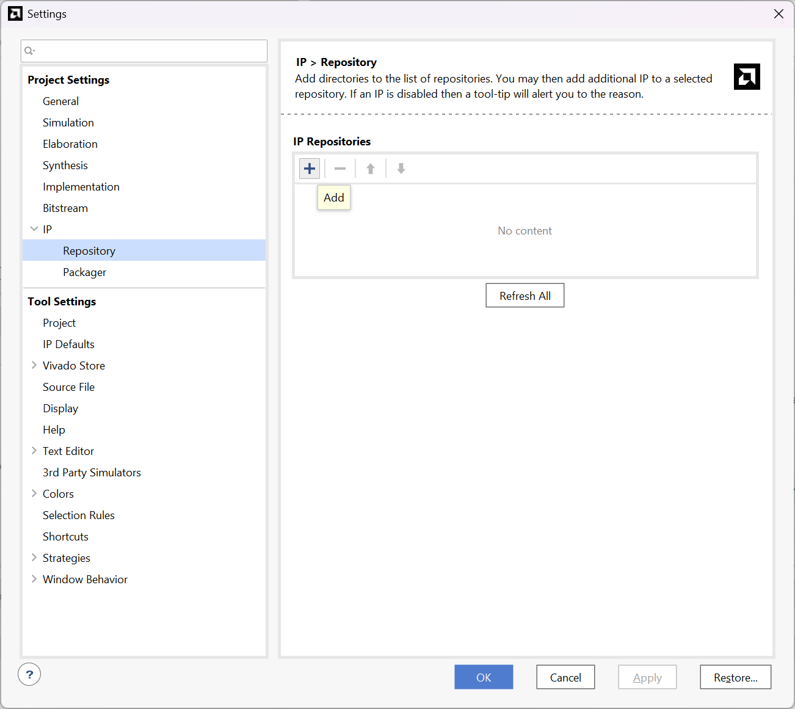

    ---

1. Select the directory where you exported your `adder` IP and press the ***Select*** button.

    > In this tutorial, the HLS project folder is selected, as recommended in [LAB2_HLS.md](./LAB2_HLS.md).

    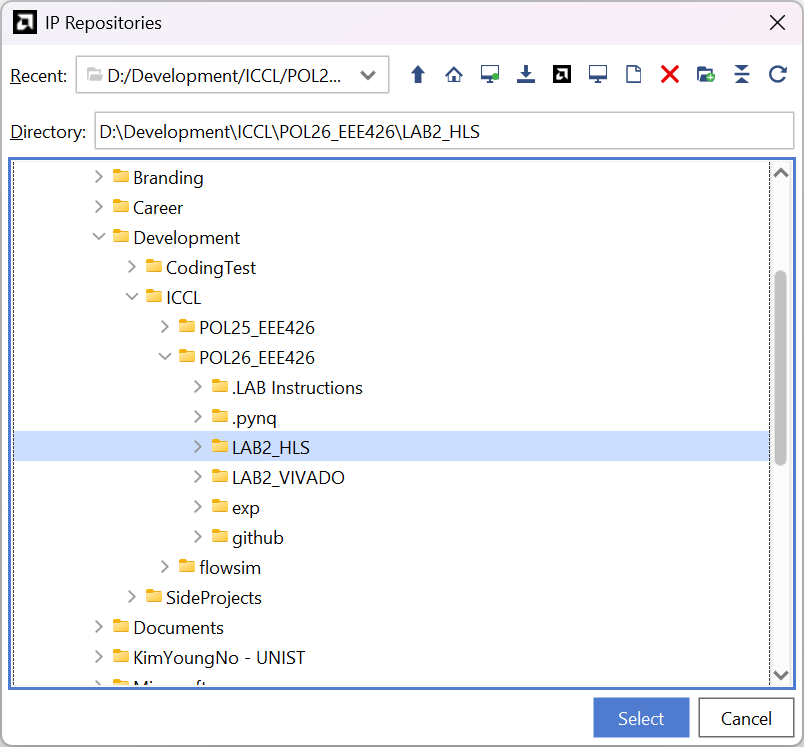

    Expected screen and result:

    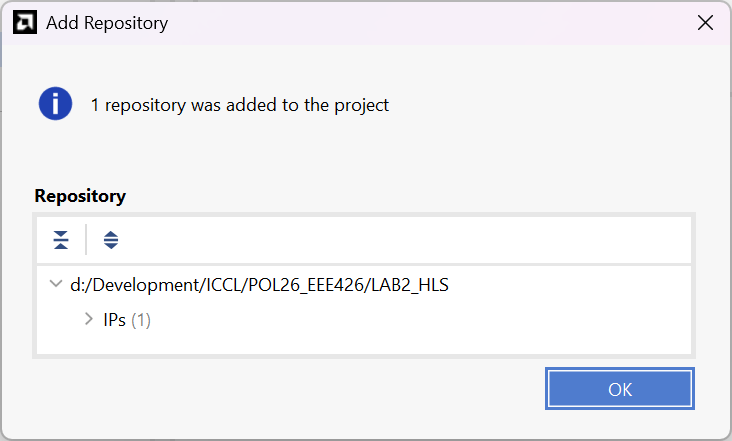

    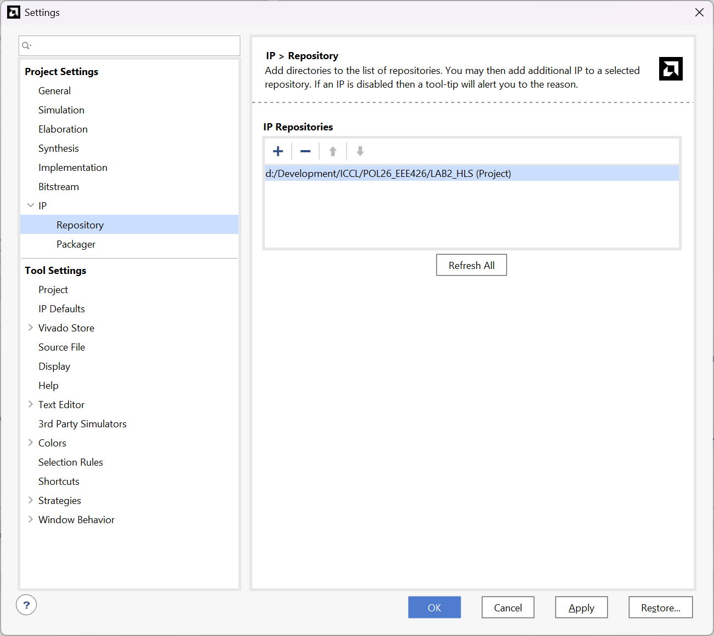

    ---

1. Create a block design and add the following IPs:  
    - one **ZYNQ7 Processing System**
    - one **AXI Interconnect**
    - one **Adder** (type 'adder' in the search browser)

    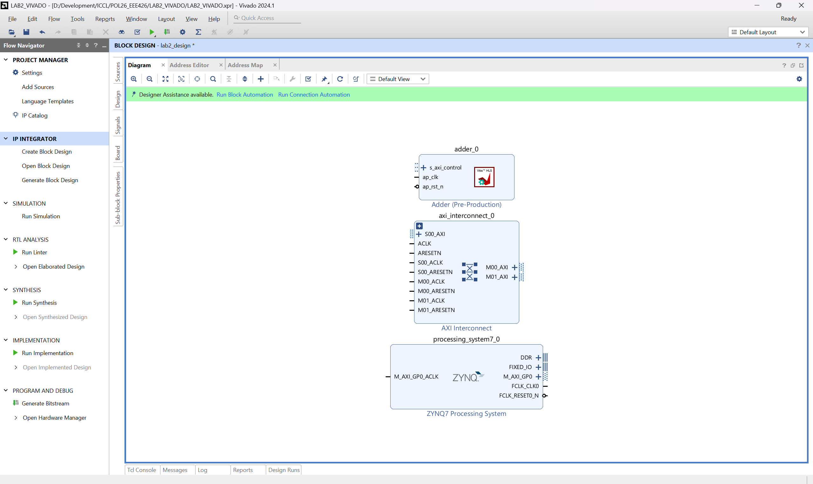

    ---

1. Configure **AXI Interconnect** as follows:
    - \# of Slave Interfaces = 1  
    - \# of Master Interfaces = 1

    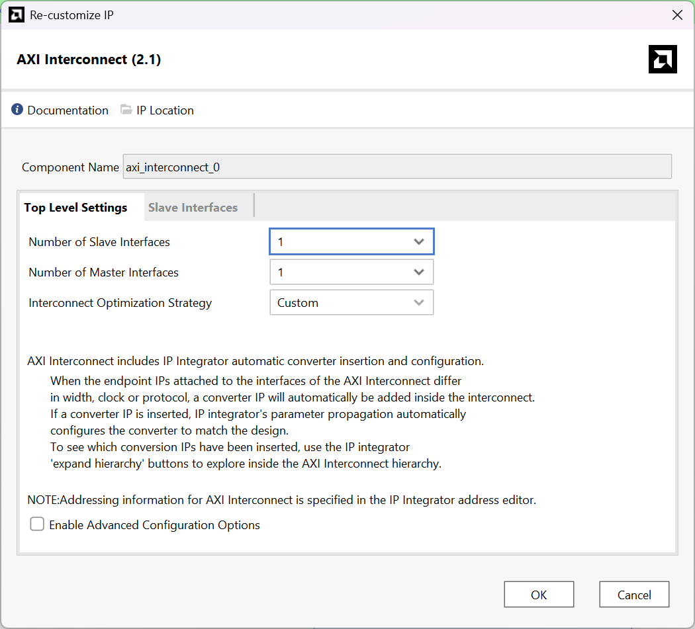

    ---

1. Click ***Run Block Automation*** and click the ***Next >*** button.

    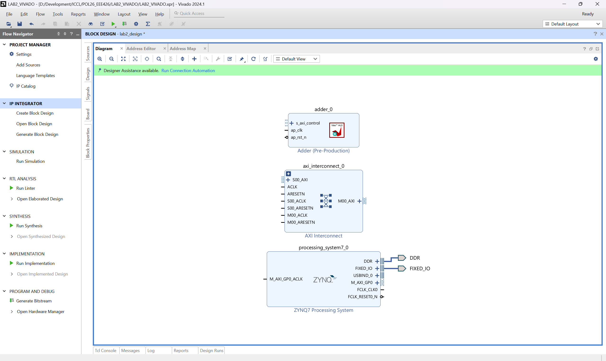

    ---

1. Connect all IPs as suggested:  
    | *axi_interconnect_0* | OTHER IPs |
    | --: | :-- |
    | `S##_AXI` | `M_AXI_GP0` : processing_system7_0 |
    | `M##_AXI` | `s_axi_control` : adder_0 |

    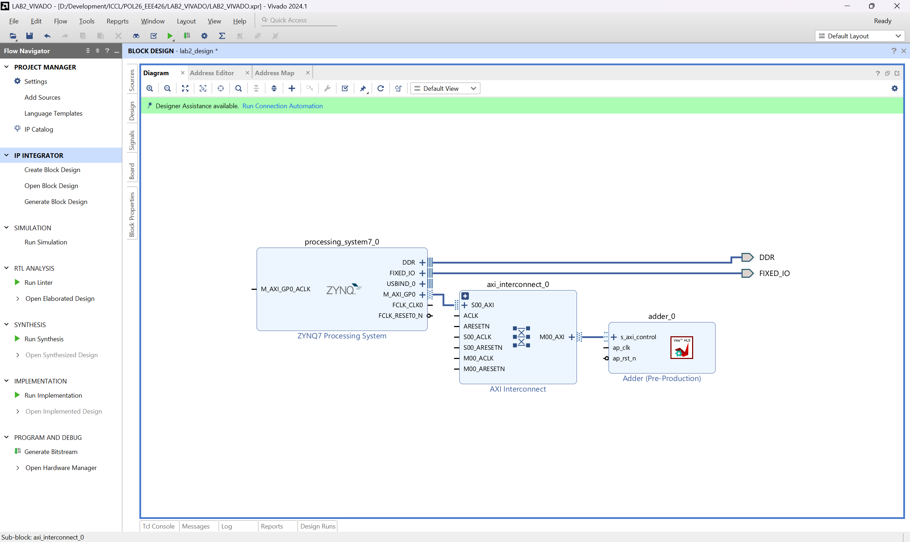

    ---

1. Click ***Run Connection Automation***, check all possible candidates, and click ***OK***.

    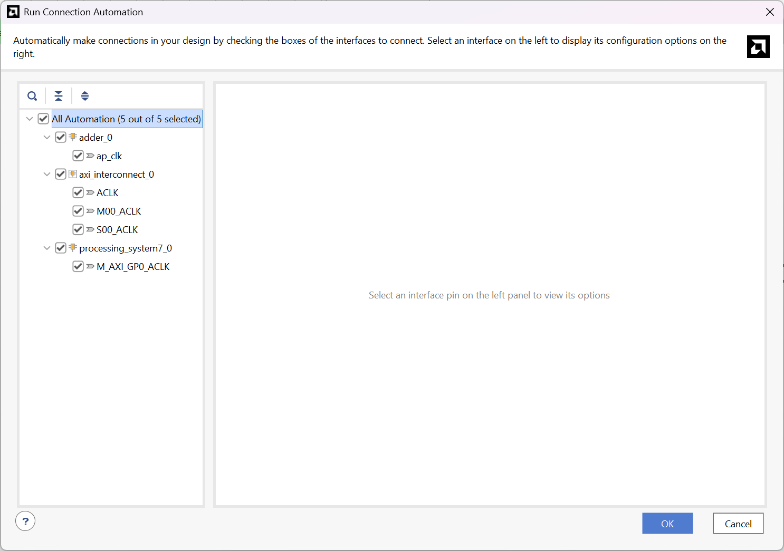

    Expected result:

    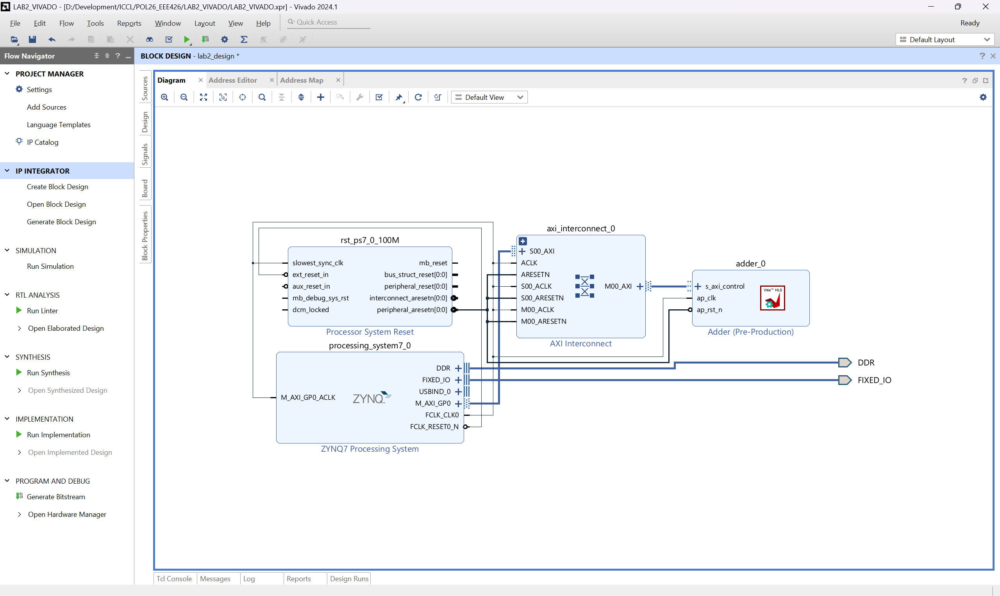

    ---

1. As done in [LAB 1](../LAB1/LAB1_VIVADO.md), generate the bitstream file and backup the `.bit` and `.hwh` files.
