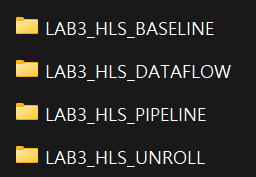

## LAB 3: Vitis HLS - Vector Add

### Vitis HLS Snippets  
&emsp;In this lab, the IP `vadd` uses new `pragma` as follows:  
```cpp
#pragma HLS INTERFACE DATAFLOW
#pragma HLS INTERFACE PIPELINE
#pragma HLS INTERFACE UNROLL
```

&emsp;Those `pragma` has some contraints to use. They cannot be placed anywhere in the source code. The following instructions show how `pragma` affects to actual timing and where `pragma` can be used. Please read [references](./README.md#references) for more details.

---

#### `#pragma HLS PIPELINE`

&emsp;`PIPELINE` reduces the initiation interval (II) by allowing the concurrent execution of operations. For example,
```cpp
for (i=0; i<a; ++i)
{
    op_read();
    op_compute();
    op_write();
}
```
&emsp;the loop can be sequential as follows:
```
clock:
┌─────────┐         ┌─────────┐         ┌─────────┐         ┌
┘         └─────────┘         └─────────┘         └─────────┘
◄----------- II=3 -----------►
┌─────────┬─────────┬─────────┬─────────┬─────────┬─────────┬
│  READ   │ COMPUTE │  WRITE  │  READ   │ COMPUTE │  WRITE  │ ... 
└─────────┴─────────┴─────────┴─────────┴─────────┴─────────┴
```

&emsp;On the other hand, when `#pragma HLS PIPELINE` is applied in the loop body:
```cpp
for (i=0; i<a; ++i)
{
#pragma HLS PIPELINE
    op_read();
    op_compute();
    op_write();
}
```
&emsp;the loop body is pipelined optimized to the lowest II.
```
clock:
┌─────────┐         ┌─────────┐         ┌─────────┐         ┌
┘         └─────────┘         └─────────┘         └─────────┘

┌─────────┬─────────┬─────────┐
│  READ   │ COMPUTE │  WRITE  │
└─────────┴─────────┴─────────┘
          ┌─────────┬─────────┬─────────┐
◄- II=1 -►│  READ   │ COMPUTE │  WRITE  │
          └─────────┴─────────┴─────────┘
                    ┌─────────┬─────────┬─────────┐
                    │  READ   │ COMPUTE │  WRITE  │ ...
                    └─────────┴─────────┴─────────┘
```

&emsp;for note, loop carry dependencies can prevent pipelining. It is important to write code in low dependent dataflow or using explicit dependency directives.

---

#### `#pragma HLS UNROLL`

&emsp;`UNROLL` unrolls a loop by replicating its body multiple times, converting sequential loop iterations into parallel execution. For example,
```cpp
for (int i=0; i<N; ++i)
{
#pragma HLS PIPELINE
    c[i] = a[i] + b[i];
}
```
&emsp;can be illustrated as:
```
a: ├ READ ┐  ├ READ ┐  ├ READ ┐  ├ READ ┐  ├ READ ┐  ├ REA ...
b: └ READ ┤  └ READ ┤  └ READ ┤  └ READ ┤  └ READ ┤  └ REA ...
+:        └ ADD ┐   └ ADD ┐   └ ADD ┐   └ ADD ┐   └ ADD ┐  ...
c:              └─ WRITE ─┴─ WRITE ─┴─ WRITE ─┴─ WRITE ─┴─ ...

                                 Total N times WRITE --------►
```

&emsp;But, when `#pragma HLS UNROLL` is applied:
```cpp
for (int i=0; i<N; ++i)
{
#pragma HLS PIPELINE
#pragma HLS UNROLL
    c[i] = a[i] + b[i];
}
```
&emsp;assuming the loop body is fully unrolled,
```
a_0:     ├ READ ┐                   Total 
b_0:     ├ READ ┤                  N times
+_0:     │      └ ADD ┐             WRITE
c_0:     │            └─ WRITE ─┐     |
 ⋮                                     ⋮
a_{N-1}: ├ READ ┐               │     |
b_{N-1}: └ READ ┤               │     |
+_{N-1}:        └ ADD ┐         │     |
c_{N-1}:              └─ WRITE ─┤     ▼
```

&emsp;for note, using too many `UNROLL` may occupy lots of resources of the Pynq. Utilize it wisely.

---

#### `#pragma HLS DATAFLOW`
&emsp;`DATAFLOW` enables task-level pipelining, allowing functions and loops to overlap in their operation. For example,

```cpp
void top(port_t a, port_t b, port_t c, port_t d)
{
...
    FUNC_A(a, b, i1);
    FUNC_B(c, i1, i2);
    FUNC_C(i1, d);
    return;
}
```
&emsp;the top function can be sequential as follows:
```
clock:
┌────┐    ┌────┐    ┌────┐    ┌────┐    ┌────┐    ┌────┐    ┌
┘    └────┘    └────┘    └────┘    └────┘    └────┘    └────┘
◄------------------ II=9 -------------------►
┌─────────┬───────────────────┬──────────────┬─────────┬─────
│ FUNC_A  │      FUNC_B       │    FUNC_C    │ FUNC_A  │      ...
└─────────┴───────────────────┴──────────────┴─────────┴─────
```
&emsp;When `DATAFLOW` is applied:
```
clock:
┌────┐    ┌────┐    ┌────┐    ┌────┐    ┌────┐    ┌────┐    ┌
┘    └────┘    └────┘    └────┘    └────┘    └────┘    └────┘
◄------ II=3 ------►
┌─────────┐         ┌─────────┐         ┌─────────┐
│ FUNC_A  │         │ FUNC_A  │         │ FUNC_A  │           ...
└─────────┤         └─────────┤         └─────────┤
┌─────────┴─────────┬─────────┴─────────┬─────────┴─────────┬
│      FUNC_B       │      FUNC_B       │      FUNC_B       │ ...
└─────────┬─────────┴─────────┬─────────┴─────────┬─────────┴
          ├──────────────┐    ├──────────────┐    ├──────────
          │    FUNC_C    │    │    FUNC_C    │    │           ...
          └──────────────┘    └──────────────┘    └──────────
```

&emsp;note that the data dependency between the tasks is arbitrary.

</br>

---

### Vitis HLS Tutorial  

1. Create a new project as done in [LAB 2](../LAB2/LAB2_HLS.md).

1. Download all [HLS sources](./hls_sources) in the project.

1. Close Vitis HLS.

1. Copy the project folder and make 4 differnt project as follows:

    

    ---

1. Open each project file and add each sources in the project, then change the top function name as follows:

    `LAB3_HLS_BASELINE/vadd_ip.h`:  
    ```cpp
    #define SIZE 16
    #define TOP_VADD vadd_baseline
    ...
    ```

    `LAB3_HLS_PIPELINE/vadd_ip.h`:  
    ```cpp
    #define SIZE 16
    #define TOP_VADD vadd_pipeline
    ...
    ```

    `LAB3_HLS_PIPELINE/vadd_ip.cpp`:  
    ```cpp
    ...
    	for (int i=0; i<SIZE; ++i)
	    {
    #pragma HLS PIPELINE    // uncomment
    //#pragma HLS UNROLL
		c[i] = a[i] + b[i];
	    }
    ...
    ```

    `LAB3_HLS_UNROLL/vadd_ip.h`:  
    ```cpp
    #define SIZE 16
    #define TOP_VADD vadd_unroll
    ...
    ```

    `LAB3_HLS_UNROLL/vadd_ip.cpp`:  
    ```cpp
    ...
    	for (int i=0; i<SIZE; ++i)
	    {
    //#pragma HLS PIPELINE
    #pragma HLS UNROLL          // uncomment
		    c[i] = a[i] + b[i];
	    }
    ...
    ```

    `LAB3_HLS_DATAFLOW/vadd_ip.h`:  
    ```cpp
    #define SIZE 16
    #define TOP_VADD vadd_dataflow
    ...
    ```

    `LAB3_HLS_DATAFLOW/vadd_ip.cpp`:  
    ```cpp
    ...
    #pragma HLS INTERFACE s_axilite port=return bundle=CTRL

    #pragma HLS DATAFLOW            // uncomment
        int cbuf[SIZE];             // make buffer

	    for (int i=0; i<SIZE; ++i)
        {
    #pragma HLS PIPELINE            // uncomment
    //#pragma HLS UNROLL              
            cbuf[i] = a[i] + b[i];  // assign result
        }
        for (int i=0; i<SIZE; ++i)  // push to output
        {
    #pragma HLS UNROLL
            c[i] = cbuf[i];
        }
    ...
    ```

    ---

1. Check every project has corresponding top function name in the ***Project*** &ndash; ***Project Settings*** &ndash; ***Synthesis*** &ndash; ***Top Function*** field.

1. Do **C Simulation**, **C Synthesis**, **Cosimulation** and **RTL Export** for all `vadd` IPs.