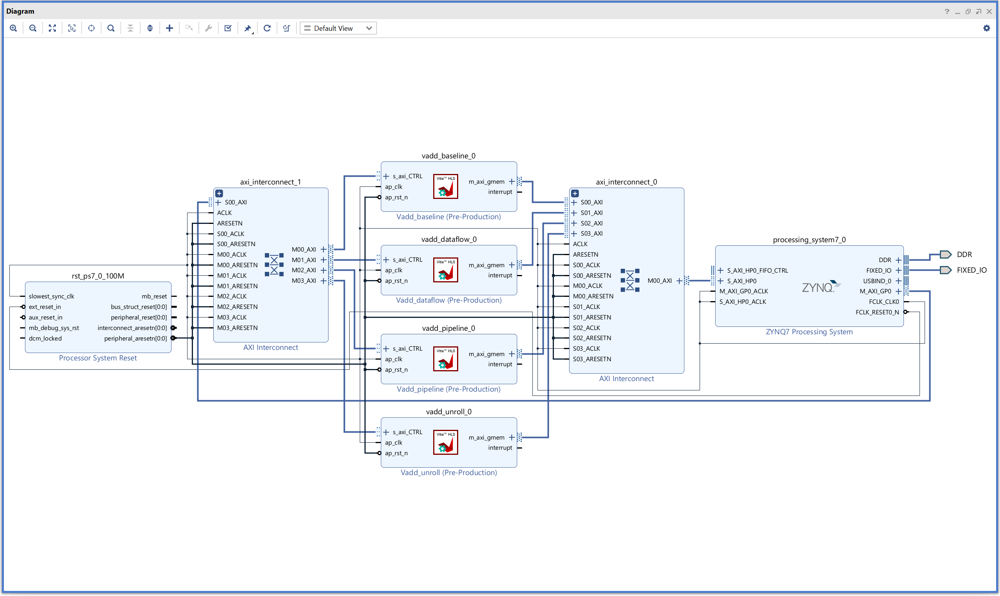

## LAB 3: Vitis HLS - Vector Add

### Vivado Tutorial

1. Open Vivado and create a project as done in [LAB 1](../LAB1/LAB1_VIVADO.md).

1. Press ***Settings*** on the toolbar and add the exported IPs' folder as repositories, as done in [LAB 2](../LAB2/LAB2_VIVADO.md).

1. Create a new block design and build the following diagram.

    

    ---

1. As done in [LAB 1](../LAB1/LAB1_VIVADO.md), generate the bitstream file and backup the `.bit` and `.hwh` files.