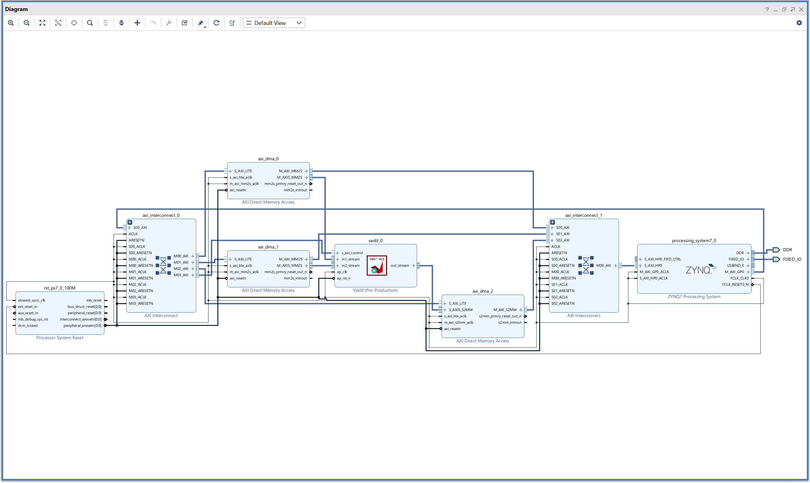

## LAB 4: Vitis HLS - Vector Add w. DMA

### Vivado Tutorial

&emsp;Top-level diagram:

&emsp;Composed of:  
1. Two `AXI Interconnect`  
1. Three `Direct Memory Access`  
1. One `ZYNQ7 Processing System`  
1. One `vadd` module  

&emsp;Set your own configuration on `Direct Memory Access`, disabling `Gather Scatter Engine`.