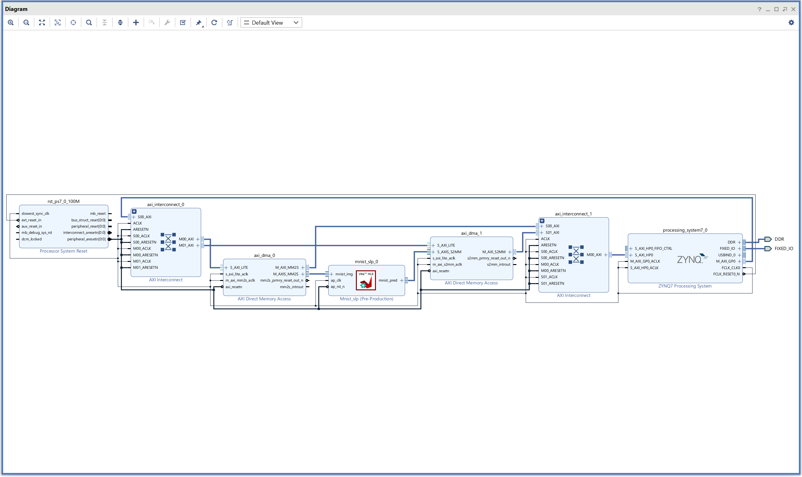

## LAB 6: Embedding & Optimizing Quantized Neural Network on Pynq-Z2

### Vivado Tips

&emsp;Top-level diagram:

&emsp;Composed of:  
1. Two `AXI Interconnect`  
1. Two `Direct Memory Access`  
1. One `ZYNQ7 Processing System`  
1. One `mnist_slp` module  

&emsp;For `Direct Memory Access`, here is how to calculate the minimum ***Width of Buffer Length Register***:

1. Calculate the input data size per single kernel call:

    > *Example*  
    > allocate(shape=**[100, 28, 28]**, dtype=**np.float32**)  
    > → 100×28×28×4 Bytes = 313600 Bytes

1. Calculate the minimum $n$ satisfying the following equation:  

    $$
    \text{input data size (Bytes)} \leq 2^n
    $$

1. Enter the value of $n$ in the ***Width of Buffer Length Register*** field.